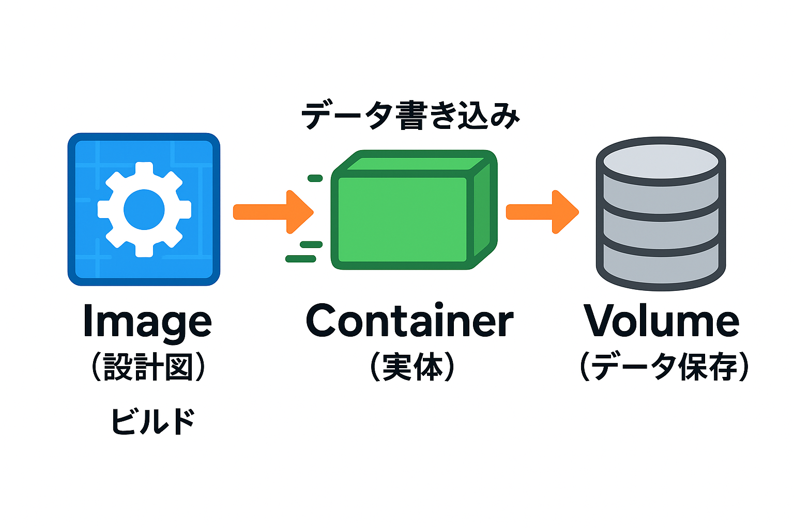

# DockerでLaravelを動かそう！  
〜ボリュームで学ぶ「消える/残る」体験ハンズオン〜

---

## 1. そもそもDockerとは？

現代のソフトウェア開発では、「自分のPCでは動くのに、他の人のPCや本番サーバーでは動かない」という問題が頻繁に発生します。これは、OSやミドルウェア、ライブラリのバージョン違い、設定の差異など、環境の違いが原因です。<br>
Dockerは、こうした「環境差によるトラブル」を根本から解決するために生まれた技術です。Dockerを使うことで、アプリケーションとその動作に必要な環境（OS・ミドルウェア・設定など）を"コンテナ"という単位でパッケージ化し、どこでも同じ環境を再現できます。<br>
この仕組みにより、開発・テスト・本番のすべての場面で「動くはずなのに動かない」をなくし、**Infrastructure as Code（環境構成もコードで管理）**を実現します。

---

## 2. Dockerの思想・なぜ生まれたか

Dockerの根底にあるのは「アプリケーションを"どこでも同じように"動かす」ことです。従来の仮想マシン（VM）はOSごと仮想化するため重く、起動も遅いという課題がありました。DockerはホストOSのカーネルを共有しつつ、アプリごとに独立した環境（コンテナ）を作ることで、**軽量かつ高速な仮想化**を実現しています。

また、Dockerでは環境構築手順をDockerfileという「コード」として管理できます。これにより、誰がどこでビルドしても同じ環境が再現でき、バージョン管理や自動化（CI/CD）にも強くなります。<br>
さらに、Dockerは「再現性」「移植性」「スケーラビリティ」を重視して設計されており、クラウドやオンプレミス、ローカルPCなど、どこでも同じイメージを使ってアプリを動かせます。

---

## 3. こんな経験ありませんか？

ソフトウェア開発の現場では、次のような課題がよく発生します。

- 「自分のPCでは動くのに、他の人のPCでは動かない」
- OSやミドルウェア、PHP/Nodeのバージョン違いによる不具合
- "依存パッケージ地獄"や"謎のエラー"
- 本番環境だけで発生するバグ

こうした問題は、**環境の差分**が原因であることがほとんどです。Dockerを使えば、アプリケーションとその動作環境を丸ごとパッケージ化できるため、誰がどこで動かしても「同じ環境・同じ挙動」を保証できます。<br>
また、GitHubなどのバージョン管理サービスと組み合わせることで、**ソースコードと環境構成（Dockerfile等）をセットで管理・共有**でき、チーム全員が「同じ手順・同じ環境」で開発できるようになります。

---

## 4. 覚えるのはこの3語

- **Image（イメージ）**
    - アプリケーションを動かすための「設計図」や「レシピ」のようなものです。
    - どんなOS・ミドルウェア・アプリ本体・設定が必要かをまとめた"ひな型"で、Dockerfileから作成されます。
    - 例えるなら「料理のレシピ本」。このレシピから何度でも同じ料理（＝コンテナ）を作れます。

- **Container（コンテナ）**
    - イメージをもとに実際に動かす「実体」です。
    - 料理で言えば、レシピから作った"できあがった料理"そのもの。
    - コンテナは「使い捨て」が前提で、壊してもまたイメージからすぐ作り直せます。
    - 1つのイメージから複数のコンテナを同時に作ることも可能です。

- **Volume（ボリューム）**
    - コンテナの外にある「データの保存場所」や「倉庫」のようなものです。
    - コンテナは削除すると中のデータも消えますが、ボリュームに保存したデータはコンテナを消しても残ります。
    - 例えば、アプリのアップロードファイルやDBデータなど、消したくないデータをボリュームに保存します。
    - 複数のコンテナで同じボリュームを共有することもできます。



---

## 5. Dockerのイメージとコンテナのライフサイクル

- **イメージ**：DockerHubからpull or buildで作成
- **コンテナ**：イメージからrunで作成、Created→Up→Exitedの状態遷移
- コンテナは削除できる（Exited状態でのみ）
- イメージも削除可能

### スクラップアンドビルドの思想

- Dockerのコンテナは「スクラップアンドビルド（壊して作り直す）」が前提
- **コンテナは使い捨て**：壊しても、また同じイメージからすぐに新しいコンテナを作れる
- これにより「環境が壊れてもすぐ再現」「テストや検証も気軽にできる」
- **本番運用でも"壊して作り直す"ことで常にクリーンな状態を保てる**


```sh
# 1. Ubuntuイメージを取得（pull）
docker image pull ubuntu

# 2. Ubuntuコンテナを起動し、シェルに入る
# （-it: 対話モード、bash: シェル起動）
docker run -it ubuntu

# 3. すべてのコンテナ一覧を表示（-a: 停止中も含む）
docker container ls -a

# 4. コンテナを停止（IDはls -aで確認）
docker container stop <ID>

# 5. 停止したコンテナを削除
docker container rm <ID>

# 6. イメージを削除（IDはdocker imagesで確認）
docker image rm ubuntu
```
参考: [Qiita: Dockerのイメージ/コンテナのライフサイクルと基本操作](https://qiita.com/kenny_J_7/items/ef4a5eb412ff943410e3)

---

## 6. 今回のゴールと構成

- 1コンテナで**Laravel**だけを動かす
- DBはSQLiteや外部MySQLを使う
- **ボリュームの有無で「プロジェクトが消える/残る」を体験**

---

## 7. なぜこの順番で体験するのか？

- まず「消える」体験で、**コンテナの一時性**を実感
- 次に「残る」体験で、**Volumeの重要性**を体感
- 理屈より**体験**で理解が深まる！

---

## 8. GitHubリポジトリ構成

```
📦 project-root
 ├─ Dockerfile
 ├─ README.md
 └─ src/       (Laravelプロジェクトが入る)
```

---

## 9. Hands-on：DockerとGitHubで環境を体験しよう

### 9-1. Docker公式イメージからコンテナを作成してみよう

#### 1. DockerHubでイメージを探す
- 公式イメージ一覧: https://hub.docker.com/search?q=&type=image

#### 2. まずはhello-worldを動かす
```sh
docker run hello-world
```
- 「Hello from Docker!」が表示されればOK

#### 3. Ubuntuコンテナでシェルを触ってみる
```sh
docker run -it ubuntu bash
```
- `ls`, `cat /etc/os-release` などで中身を確認
- `exit`で抜ける

#### 4. コンテナのライフサイクルを体験
```sh
docker ps -a
docker rm <コンテナID>
docker images
docker rmi <イメージID>
```
- **ポイント**: コンテナは「使い捨て」、イメージから何度でも作り直せる

---

### 9-2. GitHubからLaravelリポジトリをクローン

#### 1. リポジトリをクローン
```sh
git clone https://github.com/daiseilog111063/git_docker_handson_simple
cd laravel-docker-handson
```
- `Dockerfile`や`README.md`、`src/`ディレクトリが含まれていることを確認

#### 2. ここがポイント！
- **ソースコードと環境構成（Dockerfile等）がセットで管理・共有できる**
- チーム全員が「同じ手順・同じ環境」で開発できる

---

### 9-3. クローンしたリポジトリでビルド＆コンテナ起動

#### 1. Dockerイメージをビルド
```sh
docker build -t my-laravel .
```
- `-t`でイメージ名を指定

#### 2. コンテナを起動
```sh
docker run -d -p 8080:80 --name my-laravel my-laravel
```
- `http://localhost:8080/` でLaravelのWelcome画面が表示されることを確認

#### 3. コンテナの中に入ってみる
```sh
docker exec -it my-laravel bash
```
- `ls /var/www/html` でLaravelプロジェクトの中身を確認
- `exit`で抜ける

#### 4. コンテナを削除してみる
```sh
docker stop my-laravel
docker rm my-laravel
```
- **ポイント**: コンテナを削除すると中のデータも消える（使い捨ての思想）

---

### 9-4. ボリュームマウントの体験（補足）

#### 1. ホスト側でsrcディレクトリを用意
```sh
mkdir -p src
```

#### 2. ボリュームマウントしてコンテナを起動
```sh
docker run -d -p 8080:80 -v $(pwd)/src:/var/www/html --name my-laravel my-laravel
```
- `src`ディレクトリがコンテナの`/var/www/html`と同期される

#### 3. 初回のみLaravelプロジェクトを作成
```sh
docker exec -it my-laravel bash
composer create-project laravel/laravel . "^12.0"
exit
```
- 以降、`src`の中身はホスト側に永続化される

#### 4. コンテナを削除してもsrcの中身は残る
```sh
docker stop my-laravel
docker rm my-laravel
ls src
```
- **ポイント**: ボリュームを使うと「データの永続化」「ホストとコンテナのファイル共有」ができる

---

## 10. よくあるエラー・トラブル時のヒント

- **Directory is not empty**  
  → `src`が空でないとcreate-projectでエラー
- **Permission denied**  
  → `src`の権限を確認（chmod/chown）
- **ポート競合**  
  → 8080番ポートが他で使われていないか確認
- 困ったら `docker logs` や `docker exec -it ... bash` で中を見てみよう

---

## 11. まとめ

- **Dockerを使うことで「どこでも同じ環境」を簡単に再現できる**  
  → 環境差分による「動かない」を根本から解決できる

- **GitHubでソースコードと環境構成（Dockerfile等）をセットで管理・共有できる**  
  → チーム全員が「同じ手順・同じ環境」で開発・検証できる

- **コンテナは"使い捨て"が前提（スクラップアンドビルド）**  
  → 壊してもすぐ再現できるので、トラブル時も安心してリセットできる

- **ボリュームは"データの永続化"や"ホストとのファイル共有"に便利なオプション**  
  → 必要に応じて使い分けることで、開発効率や運用の柔軟性が高まる

- **今回のハンズオンで得た知識・体験は、現場の開発や本番運用でも必ず役立つ！**
